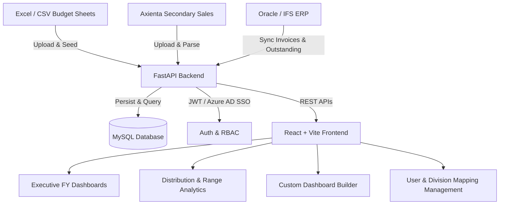

# GS Health Dashboard (GSH Dashboard)

An enterprise-grade financial, sales, and distribution analytics platform designed to monitor revenue performance, budget achievement, range-level growth, and ERP reconciliation across business divisions.

---

## 📌 Table of Contents
1. [Project Overview](#-project-overview)
2. [Architecture & Tech Stack](#-architecture--tech-stack)
3. [End-to-End System Flow](#-end-to-end-system-flow)
4. [Core Features & Modules](#-core-features--modules)
5. [Database Schema Overview](#-database-schema-overview)
6. [Installation & Setup Guide](#-installation--setup-guide)
   - [Backend Setup](#1-backend-setup-fastapi)
   - [Frontend Setup](#2-frontend-setup-react--vite)
7. [Environment Configuration (`.env`)](#-environment-configuration-env)
8. [API Endpoints Reference](#-api-endpoints-reference)

---

## 🌟 Project Overview

**GS Health Dashboard** centralizes multi-channel commercial data into a unified executive cockpit. It connects secondary sales distribution (Axienta), ERP systems (Oracle / IFS), and fiscal budgets (Excel / CSV) into interactive real-time dashboards for executives, finance teams, and brand managers.

---

## 🏗️ Architecture & Tech Stack



### **Backend**
- **Runtime & Framework**: Python 3.10+ / FastAPI
- **Server**: Uvicorn (ASGI)
- **Database**: MySQL 8.x
- **Authentication**: JWT (JSON Web Tokens) + Microsoft Azure AD (Entra ID) OAuth2 Single Sign-On
- **Security & Utilities**: SlowAPI (Rate Limiting), Passlib / Bcrypt, Pandas & OpenPyXL (Data Processing)

### **Frontend**
- **Framework**: React 18+ with Vite
- **Styling**: Modern Vanilla CSS + Responsive Design System
- **Icons & Visualization**: Lucide Icons, Charting & Data Grid Components
- **State & Routing**: React Context API (`AuthContext`), React Router DOM

---

## 🔄 End-to-End System Flow

```
+-----------------------------------------------------------------------------------+
| 1. DATA INGESTION & ERP SYNC                                                      |
|    - Upload Annual / Distribution Budget Excel sheets                             |
|    - Upload Axienta RD Sales files                                                |
|    - Sync Invoices and Outstanding debt from Oracle/IFS ERP                      |
+------------------------------------------+----------------------------------------+
                                           |
                                           v
+-----------------------------------------------------------------------------------+
| 2. MAPPING & TRANSFORMATION ENGINE                                                |
|    - Map raw SKUs to Divisions, Categories, and Sales Groups                     |
|    - Normalize quantities, gross values, discounts, and net revenue               |
|    - Apply Fiscal Year calendars and monthly date buckets                         |
+------------------------------------------+----------------------------------------+
                                           |
                                           v
+-----------------------------------------------------------------------------------+
| 3. CALCULATION & PERFORMANCE METRICS                                              |
|    - Actual Sales vs. Target Budget (Achievement %)                               |
|    - Current Year vs. Last Year Growth (Growth %)                                 |
|    - Product level, Range level, and Sales Group level aggregations               |
+------------------------------------------+----------------------------------------+
                                           |
                                           v
+-----------------------------------------------------------------------------------+
| 4. PRESENTATION & ACCESS CONTROL                                                  |
|    - Role-Based Access Control (Admin, Management, Brand Manager, Viewer)         |
|    - Interactive KPI Dashboards, Drilldown Trees, and Excel Export Reports        |
+-----------------------------------------------------------------------------------+
```

---

## 🚀 Core Features & Modules

### 1. **Fiscal Year (FY) Dashboards**
- **Executive Summary (`DashboardFyPage`)**: High-level KPIs, total company revenue, budget achievement, and monthly sales trends.
- **Distribution Dashboard (`DisDashboardFyPage`)**: Channel-wise sales group performance and distribution targets.
- **Hierarchical Range Explorer (`DistriRangeFyPage` & `TotalRangeFyPage`)**: Drilldown tree views showing Division ➔ Range ➔ Product / SKU breakdowns.
- **Custom Dashboard (`DashboardCreatePage`)**: Drag-and-drop / configurable widget dashboard for personalized analytics.

### 2. **Data Integration & Uploads**
- **Budget Uploaders (`UploadAnnualBudgetPage`, `UploadDisBudgetPage`)**: Ingests multi-tab annual and distribution budget sheets with automated validation.
- **Axienta Sales Ingestion (`UploadAxientaDataPage`)**: Parses distribution sales Excel files with quantity and revenue recognition.
- **ERP Synchronization (`InvoiceSyncPage`, `OutstandingSyncPage`)**: Synchronizes enterprise billing records and receivables.

### 3. **Master Data & Mapping Management**
- **Division Mapping (`MapDivisionsPage`)**: Assigns SKUs and products to business divisions and sales ranges.
- **Category & Sales Group Config**: Organizes items into standardized reporting dimensions.

### 4. **User & Access Management**
- **Local & Azure AD SSO Login (`LoginPage`)**: Corporate single sign-on with automatic account provisioning.
- **User Admin (`ManageUsersPage`)**: Role-Based Access Control (RBAC) to control access to sensitive financial metrics.

---

## 🗄️ Database Schema Overview

The MySQL database (`gsh_dashboard`) contains key relational and reporting tables:

| Table | Description |
| :--- | :--- |
| `users` | User credentials, roles, email, active status, and Azure AD IDs |
| `invoice_output` | Core sales invoice records from ERP / sales files |
| `outstanding_output` | Accounts receivable and outstanding payment balances |
| `annual_budget` | Budget targets by SKU, division, and fiscal month |
| `dis_budget` | Distribution channel targets and sales group allocations |
| `axienta_data` | Secondary sales records ingested from Axienta |
| `division_mappings` | SKU-to-Division, Brand, and Category lookup rules |

---

## 🛠️ Installation & Setup Guide

### Prerequisites
- **Python**: 3.10 or higher
- **Node.js**: 18+ and `npm`
- **MySQL**: 8.0+ server running on port `3306`

---

### 1. Backend Setup (FastAPI)

```powershell
# Navigate to the backend directory
cd backend

# Create and activate Python virtual environment (if not already created)
python -m venv .venv
.\.venv\Scripts\activate       # On Windows PowerShell
# source .venv/bin/activate    # On Linux / macOS

# Install required dependencies
pip install -r requirements.txt

# Configure environment variables
# Copy .env.example to .env and adjust your MySQL credentials & Azure AD keys
copy .env.example .env

# Initialize database schema
python database.py

# Start the development server
python -m uvicorn main:app --reload --host 127.0.0.1 --port 8000
```
Backend API will be accessible at: `http://127.0.0.1:8000`  
Swagger API Docs available at: `http://127.0.0.1:8000/docs`

---

### 2. Frontend Setup (React + Vite)

```powershell
# Open a new terminal and navigate to the frontend directory
cd frontend

# Install Node dependencies
npm install

# Start Vite development server
npm run dev
```
Frontend Web App will run at: `http://localhost:5173`

---

## ⚙️ Environment Configuration (`.env`)

Configure `backend/.env` with your deployment and security settings:

```env
# MySQL Database Connection
MYSQL_HOST=localhost
MYSQL_PORT=3306
MYSQL_USER=dashboard_admin
MYSQL_PASSWORD=YourSecurePassword
MYSQL_DB=gsh_dashboard

# JWT Authentication
JWT_SECRET_KEY=YourSuperSecretKeyGoesHere
JWT_ALGORITHM=HS256
JWT_EXPIRE_HOURS=8

# Microsoft Azure AD (Entra ID) OAuth2 Single Sign-On
AZURE_CLIENT_ID=your-azure-client-id
AZURE_CLIENT_SECRET=your-azure-client-secret
AZURE_TENANT_ID=your-azure-tenant-id
AZURE_REDIRECT_URI=http://localhost:8000/api/auth/microsoft/callback

# Frontend & CORS
FRONTEND_URL=http://localhost:5173
ALLOWED_ORIGINS=http://localhost:5173,http://127.0.0.1:5173

# Environment
APP_ENV=development
```

---

## 📡 API Endpoints Reference

| Prefix | Router | Key Functionality |
| :--- | :--- | :--- |
| `/api/auth` | [`auth.py`](file:///d:/new_GS/GS_health_Dashbord/backend/app/routers/auth.py) | Login, Microsoft OAuth SSO, session check, token refresh |
| `/api/users` | [`users.py`](file:///d:/new_GS/GS_health_Dashbord/backend/app/routers/users.py) | User CRUD, role assignments, activation status |
| `/api/dashboard-fy` | [`dashboard_fy.py`](file:///d:/new_GS/GS_health_Dashbord/backend/app/routers/dashboard_fy.py) | FY summary metrics, monthly trends, variance |
| `/api/budget` | [`budget.py`](file:///d:/new_GS/GS_health_Dashbord/backend/app/routers/budget.py) | Annual & distribution budget management |
| `/api/axienta` | [`axienta.py`](file:///d:/new_GS/GS_health_Dashbord/backend/app/routers/axienta.py) | Axienta sales data upload & parsing |
| `/api/division-mappings` | [`division_mappings.py`](file:///d:/new_GS/GS_health_Dashbord/backend/app/routers/division_mappings.py) | SKU, Range, and Division categorization |
| `/api/oracle-sync` | [`oracle_sync.py`](file:///d:/new_GS/GS_health_Dashbord/backend/app/routers/oracle_sync.py) | ERP synchronization endpoints |
| `/api/reports` | [`reports.py`](file:///d:/new_GS/GS_health_Dashbord/backend/app/routers/reports.py) | Tabular analytics and reporting exports |
| `/api/health` | [`health.py`](file:///d:/new_GS/GS_health_Dashbord/backend/app/routers/health.py) | Backend health check |

---

## 🔒 Security & Best Practices
- **Never commit `.env`** to version control (already configured in `.gitignore`).
- Passwords are encrypted using salted `bcrypt` hashes.
- Rate limiting is enforced on sensitive endpoints via `SlowAPI`.
- All database queries sanitize inputs to prevent SQL injection vulnerabilities.
